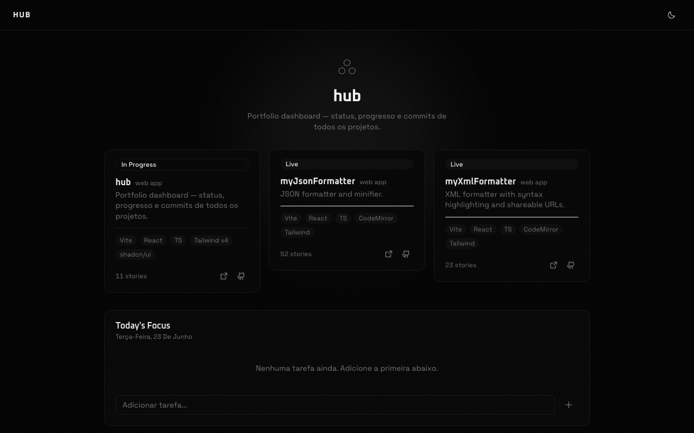
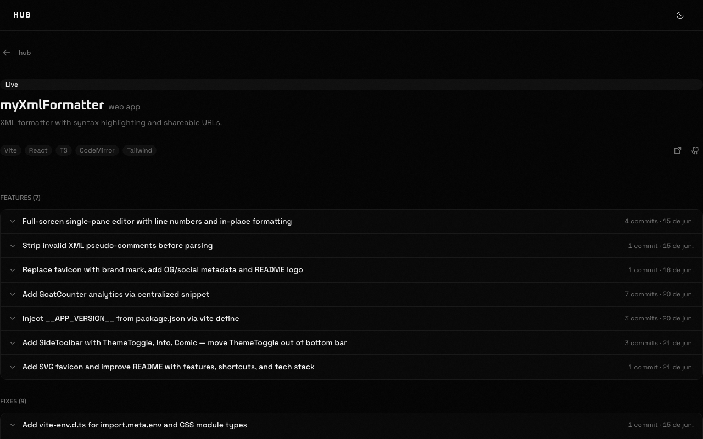

# hub

Portfolio dashboard tracking status, progress, and commit history for all of my projects.

**Live →** [geldopc.github.io/hub](https://geldopc.github.io/hub/)



---

## What it does

- Pulls project status and progress from a **Notion database** (source of truth)
- Fetches commit history from the **GitHub REST API**
- Groups commits into derived "stories" using conventional commit scopes (`feat(scope): ...`)
- Shows a timeline of stories per project with expandable commit lists



---

## Stack

| Layer | Choice |
|---|---|
| Build | Vite 6 + TypeScript |
| UI | React 19 + Tailwind v4 + shadcn/ui (zinc, dark) |
| Data fetching | TanStack Query v5 |
| Data sources | Notion API · GitHub REST API |
| Deploy | GitHub Pages via GitHub Actions |
| Tests | Playwright (E2E) + Vitest (unit) |

---

## Architecture

- **Notion as data layer** — project status and progress live in a Notion database, fetched through a Vercel Edge Function (server-side token)
- **GitHub API** — direct client fetch using `VITE_GITHUB_TOKEN`
- **Atomic design** — `elements` → `widgets` → `modules` → `templates` → `pages`
- **Commit grouper** — `src/utils/commitGrouper.ts` groups commits by conventional commit scope, falling back to consecutive type grouping

---

## Running locally

```bash
npm install
```

Create `.env.local`:

```
VITE_GITHUB_TOKEN=ghp_...
NOTION_TOKEN=secret_...
VITE_NOTION_DB_ID=f9b46a82-4664-469f-a451-dfdeec884584
VITE_API_URL=https://your-vercel-deployment.vercel.app
```

```bash
npm run dev       # dev server
npm run build     # production build
npm run typecheck # type check (separate from build)
npx playwright test  # E2E tests
```

---

## CI/CD

Push to `main` → GitHub Actions builds → deploys to GitHub Pages automatically.
Secrets `VITE_GITHUB_TOKEN` and `VITE_API_URL` are set in the repo settings.
